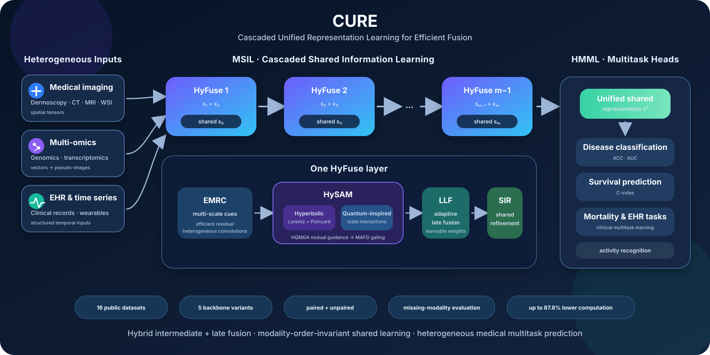

<div align="center">

# CURE

### Advancing Multimodal Fusion on Heterogeneous Medical Data with Hybrid Geometry Attention

**Joy Dhar · Manish Kumar Pandey · Nayyar Zaidi · Chen Chen · Maryam Haghighat · Ferdous Sohel · Puneet Goyal**

**Proceedings of the 32nd ACM SIGKDD Conference on Knowledge Discovery and Data Mining, Volume 2 (KDD '26)**<br>
**Jeju Island, Republic of Korea · August 9–13, 2026 · Pages 863–874**

[](https://doi.org/10.1145/3770855.3817885)
[](https://doi.org/10.1145/3770855.3817885)
[](https://arxiv.org/abs/2607.19086)
[](https://doi.org/10.1145/3770855.3817885)
[](https://www.tensorflow.org/)
[](https://www.python.org/)

[Paper](https://dl.acm.org/doi/10.1145/3770855.3817885) ·
[arXiv](https://arxiv.org/abs/2607.19086) ·
[Code](Code/CURE_KDD_2026_for_multi-disease_classification_and_patient_survival_and_moratlity_predictions%20%282%29.ipynb) ·
[Method](docs/METHOD.md) ·
[Datasets](docs/DATASETS.md) ·
[Reproducibility](docs/REPRODUCIBILITY.md) ·
[Citation](#citation)

</div>

<p align="center">
  
</p>

## Overview

**CURE**—**C**ascaded **U**nified **R**epresentation Learning for **E**fficient Fusion Network—is a lightweight and scalable framework for learning from **heterogeneous medical modalities**, including medical images, multi-omics, electronic health records, and physiological time-series data.

Instead of allocating a parallel encoder to every modality, CURE progressively incorporates modalities through a **single-pass cascade** of **Hybrid Geometry Aware Fusion (HyFuse)** layers. Each HyFuse layer captures multi-scale modality-specific cues, models cross-modal interactions in complementary hyperbolic and quantum-inspired spaces, and updates a shared representation that is passed to the next stage. This design targets three central requirements of medical multimodal learning:

- **Performance:** preserve coarse-to-fine structure while learning expressive cross-modal dependencies.
- **Efficiency:** avoid high-cost parallel modality towers and large attention matrices.
- **Generalization:** support paired and unpaired modalities, variable modality collections, and missing-modality evaluation.

The paper evaluates CURE on **16 public datasets** and reports gains of up to approximately **3.97%** while reducing computational cost by up to **87.8%** relative to leading multimodal fusion methods.

## Architecture

CURE has two phases:

1. **Multimodal Shared Information Learning (MSIL):** modalities are introduced sequentially and integrated through successive HyFuse layers to produce a modality-order-invariant shared representation.
2. **Heterogeneous Modality-Specific Multitask Learning (HMML):** the shared representation feeds task-specific heads for disease classification, survival-risk estimation, mortality prediction, and related heterogeneous prediction tasks.

### Inside a HyFuse layer

| Module | Full name | Role |
|---|---|---|
| **EMRC** | Efficient Multimodal Residual Convolution | Extracts multi-scale spatial representations with efficient heterogeneous convolutional blocks. |
| **HySAM** | Hybrid-Space Aware Attention Mixer | Learns cross-modal attention through mutually guided hyperbolic and quantum-inspired streams, followed by multimodal attention fusion gating. |
| **LLF** | Learnable Late Fusion | Adaptively combines refined modality representations with trainable fusion weights and supports masked/missing inputs. |
| **SIR** | Shared Information Refinement | Refines intermediate shared features and carries them forward through the cascade. |

HySAM is the central representation-learning component. It combines a **Hyperbolic Quantum Mutual Guidance Attention (HQMGA)** block—containing hyperbolic dual-geometry attention and quantum-inspired interaction—with a **Multimodal Attention Fusion Gating (MAFG)** block.

A more detailed component-level explanation is provided in [`docs/METHOD.md`](docs/METHOD.md).

## Why cascaded fusion?

Conventional multimodal systems often instantiate a separate backbone for every modality and fuse only after each stream has been processed. CURE instead reuses a sequential fusion path:

```text
Modality 1 + Modality 2 ── HyFuse 1 ── Shared 2
Shared 2   + Modality 3 ── HyFuse 2 ── Shared 3
Shared 3   + Modality 4 ── HyFuse 3 ── Shared 4
                         ...
Shared m ── HMML task heads ── classification / survival / mortality / activity
```

This incremental design makes the cost grow more gracefully with the number of modalities and enables the same core fusion layer to be applied to heterogeneous combinations.

## Paper-reported results

The following values summarize representative results from the paper. Consult the paper for complete dataset-wise means, standard deviations, baseline settings, and statistical comparisons.

### Representative unpaired-modality results

| Variant | HAM10000 ACC / AUC | SIPaKMeD ACC / AUC | TCGA-BRCA C-index | MIMIC-III mortality ACC / AUC |
|---|---:|---:|---:|---:|
| **CURE-V** | **99.75 / 99.99** | **97.10 / 99.95** | **65.22** | **93.37 / 97.08** |

### Paired WSI–omics survival prediction

| Variant | TCGA-BLCA C-index | TCGA-KIRP C-index |
|---|---:|---:|
| **CURE-V** | **75.9 ± 0.82** | **87.8 ± 0.57** |
| **CURE-50** | 75.1 ± 1.15 | 87.2 ± 1.03 |

### Model complexity

| Variant | Backbone | Parameters | GFLOPs | Positioning |
|---|---|---:|---:|---|
| **CURE-SN** | ShuffleNet | **3.1M** | **0.29** | Smallest variant |
| **CURE-18** | ResNet18 | 7.71M | 0.59 | Efficient default |
| **CURE-V** | ViT-Tiny | 10.8M | 1.25 | Strongest overall results in several settings |
| **CURE-IN** | Inception-v3 | 13.7M | 2.82 | Inception-based variant |
| **CURE-50** | ResNet50 | 14.4M | 1.83 | Higher-capacity CNN variant |

> **Metric note:** ACC and AUC are percentages; survival results are reported as C-index percentages. Parameter and FLOP values are those reported for the corresponding paper variants and can vary with the task head and input configuration.

## Evaluation scope

| Dimension | Coverage |
|---|---|
| Public datasets | 16 |
| Data organizations | Paired and unpaired |
| Data families | Imaging, multi-omics, WSI + omics, EHR, wearable/time-series |
| Downstream objectives | Classification, survival prediction, mortality/clinical prediction, activity recognition |
| Backbones | ResNet18, ResNet50, Inception-v3, ViT-Tiny, ShuffleNet |
| Metrics | Accuracy, AUC, C-index, parameters, GFLOPs |
| Repeated evaluation | Five random seeds |
| Missing-modality analysis | Omics-only, WSI-only, partially observed, and fully observed paired settings |

The complete benchmark inventory is documented in [`docs/DATASETS.md`](docs/DATASETS.md).

## Repository structure

```text
CURE/
├── Code/
│   └── CURE_KDD_2026_for_multi-disease_classification_and_patient_survival_and_moratlity_predictions (2).ipynb
├── assets/
│   ├── cure-overview.svg
│   └── cure-overview.png
├── docs/
│   ├── DATASETS.md
│   ├── METHOD.md
│   └── REPRODUCIBILITY.md
├── .gitignore
├── CITATION.cff
├── LICENSE-NOTICE.md
├── citation.bib
├── environment.yml
├── requirements.txt
└── README.md
```

## Getting started

### 1. Clone the repository

```bash
git clone https://github.com/misti1203/CURE.git
cd CURE
```

### 2. Create an environment

The released notebook records **Python 3.11.11** in its metadata. A compatibility-oriented environment is provided; it is not an archival lockfile for the authors' original system.

```bash
python -m venv .venv

# Linux/macOS
source .venv/bin/activate

# Windows PowerShell
# .venv\Scripts\Activate.ps1

python -m pip install --upgrade pip
pip install -r requirements.txt
```

Conda users can instead run:

```bash
conda env create -f environment.yml
conda activate cure-kdd26
```

### 3. Prepare the four-stream notebook example

The current notebook demonstrates a representative cascade over four data streams:

| Stream | Paper domain | Paths expected by the released notebook |
|---|---|---|
| 1 | HAM10000 dermoscopy | `ham10000/x_train.npy`, `x_val.npy`, `x_test.npy`, and matching labels |
| 2 | SIPaKMeD cytology | `SIPAKMED/features.npy`, `SIPAKMED/labels.npy` |
| 3 | TCGA-BRCA survival | `X_{train,val,test}_img_BRCA_updated.npy` and `y_{train,val,test}_tab_BRCA_updated.npy` |
| 4 | MIMIC-III mortality | `X_{train,val,test}_MORT_MIMIC3_updated.npy` and matching labels |

Datasets and prepared NumPy arrays are not redistributed. Place your arrays at the expected paths or edit the corresponding loading cells.

### 4. Run the notebook

```bash
jupyter lab
```

Open the <a href="Code/CURE_KDD_2026_for_multi-disease_classification_and_patient_survival_and_moratlity_predictions%20%282%29.ipynb">CURE research notebook</a> and execute it from top to bottom after updating data paths.

## Reference experiment settings

### Paper-level protocol

| Item | Reported setting |
|---|---|
| Image resolution | `128 × 128 × 3` |
| Dataset split | `80% / 10% / 10%` where applicable |
| Repeated runs | 5 random seeds |
| Epochs | 200 |
| Optimizer | Adam |
| Initial learning rate | `1e-3` |
| Scheduler floor | `1e-6` |
| Classification loss | Cross-entropy |
| Survival loss | Negative log-likelihood (NLL) |
| Main hardware | Single NVIDIA A100 80GB GPU on Ubuntu |

### Released notebook behavior

The notebook implements a four-input, four-head TensorFlow/Keras model with two categorical classification losses, one Cox-style survival loss, and one binary classification loss. It trains for 200 epochs, saves the best validation-loss checkpoint, applies early stopping and learning-rate reduction, and includes a five-seed evaluation loop.

See [`docs/REPRODUCIBILITY.md`](docs/REPRODUCIBILITY.md) before claiming exact paper-level reproduction.

## Release status

This repository currently contains **one research notebook** implementing the central four-stream CURE workflow and core HyFuse-related components. It does not yet provide:

- a unified command-line training/evaluation package;
- prepared versions of all 16 datasets;
- fixed split manifests for every benchmark;
- pretrained checkpoints for all five CURE variants;
- a single script that reproduces every table in the paper.

Accordingly, the release should be treated as a **research implementation and architectural reference**. Exact table-level reproduction requires matching the original data versions, preprocessing, splits, modality order experiments, random seeds, task heads, and framework versions.

## Citation

```bibtex
@inproceedings{dhar2026cure,
  author    = {Dhar, Joy and Pandey, Manish Kumar and Zaidi, Nayyar and
               Chen, Chen and Haghighat, Maryam and Sohel, Ferdous and
               Goyal, Puneet},
  title     = {Advancing Multimodal Fusion on Heterogeneous Medical Data
               with Hybrid Geometry Attention},
  booktitle = {Proceedings of the 32nd ACM SIGKDD Conference on
               Knowledge Discovery and Data Mining V.2},
  year      = {2026},
  pages     = {863--874},
  publisher = {Association for Computing Machinery},
  address   = {New York, NY, USA},
  series    = {KDD '26},
  location  = {Jeju Island, Republic of Korea},
  isbn      = {9798400722592},
  doi       = {10.1145/3770855.3817885},
  url       = {https://doi.org/10.1145/3770855.3817885},
  keywords  = {medical image analysis, multimodal fusion, hybrid geometry attention}
}
```

Machine-readable citation metadata is available in [`CITATION.cff`](CITATION.cff), with a standalone BibTeX record in [`citation.bib`](citation.bib).

## Responsible use

CURE is released for research and reproducibility. It is **not a clinically validated diagnostic or prognostic system** and must not be used as the sole basis for diagnosis, treatment, triage, survival estimation, or other patient-care decisions. Reported results do not establish safety under deployment shifts, unobserved institutions, data-quality failures, or regulatory requirements.

## License notice

The paper states that it is distributed under **Creative Commons Attribution 4.0 International (CC BY 4.0)**. The original GitHub repository does not currently declare an explicit software license. A publication license does not automatically license the source code. See [`LICENSE-NOTICE.md`](LICENSE-NOTICE.md) before reusing or redistributing the implementation.

## Contact

For questions about the paper or implementation:

**Joy Dhar** — `joy.22csz0003@iitrpr.ac.in`

---

<div align="center">
  <sub>CURE: efficient, scalable, hybrid-geometry multimodal fusion for heterogeneous medical data.</sub>
</div>
